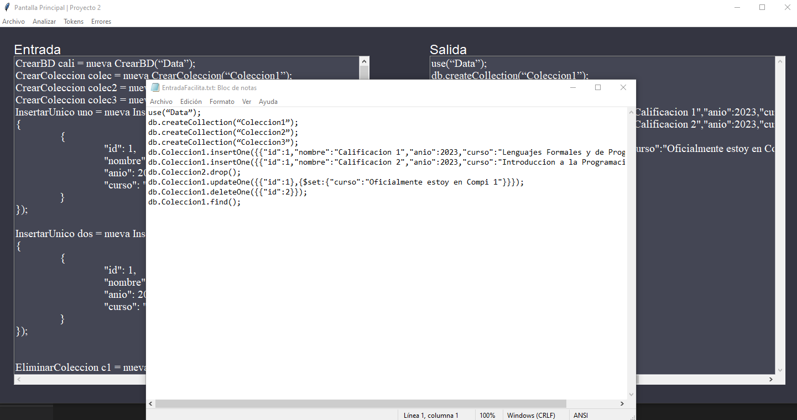

# Manual de usuario

## OBJETIVO GENERAL

Combinar los conocimientos adquiridos en el curso y en los otros cursos de sistemas, para crear un compilador que traduzca el lenguaje especificado y lo transforme en Sentencias de Bases de Datos No Relacionales.

## OBJETIVOS ESPECÍFICOS

- Crear una herramienta que permita el diseño de sentencias de base de datos no relacionales de una forma sencilla para el usuario.
- Diseñar y construir un compilador que permita compilar archivos de entrada y visualizar el resultado en un entorno externo.
- Desarrollar la habilidad del estudiante para elaborar proyectos en base a una adecuada planificación para que aprendan la manera en la que tienen que trabajar.

## BOTONES DE LA APLICACION

## Menu archivo

### Botón abrir

El botón abrir archivo permite abrir un archivo de texto plano con diferentes extensiones.

Si el archivo es de texto plano, se abrirá en el editor de texto de la aplicación, llamado **Entrada**

### Botón Nuevo

El botón nuevo como su nombre indica permite crear un nuevo archivo de texto plano, si anteriormente existia texto en el editor de texto de entrada, se mostrara una ventana de dialogo para confirmar si se desea guardar el archivo.

### Guardar

El botón guardar permite guardar el archivo de texto plano que se abrio anteriormente. Al guardar el archivo se presentara el siguiente mensaje:

### Guardar como

El botón guardar como permite guardar el archivo de texto plano que se abrio anteriormente con un nombre diferente. Se abrira una ventana donde se puede escoger la ruta y nombre del archivo a guardar

### Salir

El botón salir como su nombre indica permite cerrar el programa.

## Botón Analizar

El botón analizar realiza el analisis del archivo anteriormente cargado, si no se encuentran errores se mostrara la traducción del archivo de entrada a MongoDB en el cuadro de texto derecho llama **"Salida"**, y se creara el archivo con extensión **.txt** con las sentancias de MongoDB.

Si se encuentran errores se indicara enm el cuadro de salida que se deben de corregir los errores antes de póder traducir el archivo.

## Botón Tokens

Este botón muestra una nueva ventana con los tokens encontrados en el archivo de entrada.

## Botón Errores

Este botón muestra una nueva ventana con los errores encontrados en el archivo de entrada.

